# Polyglot Playground

**Mastering multiple stacks.** One monolithic repository. Zero boundaries.

Polyglot Playground is a consolidated engineering environment for exploring, building, and scaling applications across diverse programming languages. By isolating environments while centralizing tracking, this repository serves as a live portfolio of cross-domain software development — from high-level web platforms to low-level hardware controllers.

[](#)
[](#)
[](#)
[](#)

> | Domain | Technology | Current Focus |
> |------|-----|-------|
> | **Enterprise GUI** | Java / JavaFX | Point of Sale (POS) architecture |
> | **Web Platforms** | Next.js / React | Rapid MVP prototyping & UI/UX |
> | **AI & Automation** | Python | LLM API integrations & scripting |
> | **Hardware Control** | C++ | CNC machine stepper logic |

```bash
# Clone the entire workspace
git clone https://github.com/Udith-Nethmina/polyglot-playground.git
cd polyglot-playground

# Navigate to your domain of interest
cd nextjs/epala-mvp
npm install && npm run dev

```

> [!NOTE]
> **Monorepo Architecture.** Every project within this repository is strictly self-contained. You must review the specific `README.md` within each language directory (e.g., `/java/README.md`) for dedicated environment setup instructions, compiler requirements, and dependency management.

---

## 🚀 Key Engineering Domains

|  | Domain | Technical Focus & Capabilities |
| --- | --- | --- |
| ☕ | **Java Systems** | Object-Oriented Design, JavaFX UI/UX, database integration, and POS systems |
| ⚛️ | **Next.js Web** | Server-side rendering, responsive component architecture, and rapid MVP deployment |
| ⚙️ | **C++ Embedded** | Real-time microcontroller execution, hardware interfacing, and CNC kinematics |
| 🐍 | **Python AI** | Large Language Model (LLM) prompt engineering, API orchestration, and data handling |

---

<details>
<summary><strong>🐍 Python</strong> — Artificial intelligence and automation scripting</summary>

| Project | What It Does | Stack | Status |
| --- | --- | --- | --- |
| **LLM API Integrations** | Experimental endpoints and scripts interfacing with various Large Language Models. | Python 3.x, Requests | 🟡 Exploring |
| **Data Handlers** | Utility scripts for parsing, cleaning, and transforming data structures. | Python 3.x | 🟡 Exploring |

*See [`/python/README.md`](https://www.google.com/search?q=./python/README.md) for virtual environment (`venv`) and `pip` setups.*

</details>

---

## 🏗️ Repository Architecture

```mermaid
graph TB
    subgraph ROOT ["🌐 Polyglot Playground (Monorepo)"]
        direction TB
        
        subgraph JAVA ["☕ Java Environment"]
            J_ENV["Java Setup Guide<br/><small>JDK & JavaFX config</small>"]
            J_PROJ["Bookshop POS<br/><small>GUI & Logic</small>"]
            J_ENV --> J_PROJ
        end

        subgraph WEB ["⚛️ Next.js Environment"]
            W_ENV["Node Setup Guide<br/><small>npm/yarn config</small>"]
            W_PROJ["PixelPala MVP<br/><small>React Components</small>"]
            W_ENV --> W_PROJ
        end

        subgraph HW ["⚙️ C++ Environment"]
            H_ENV["C++ Setup Guide<br/><small>Compilers & Toolchains</small>"]
            H_PROJ["CNC Controller<br/><small>Stepper Logic</small>"]
            H_ENV --> H_PROJ
        end

        subgraph AI ["🐍 Python Environment"]
            P_ENV["Python Setup Guide<br/><small>venv & pip</small>"]
            P_PROJ["LLM Scripts<br/><small>API Integrations</small>"]
            P_ENV --> P_PROJ
        end
    end

    style ROOT fill:#0d1117,stroke:#58a6ff,color:#c9d1d9
    style JAVA fill:#161b22,stroke:#e34f26,color:#c9d1d9
    style WEB fill:#161b22,stroke:#3fb950,color:#c9d1d9
    style HW fill:#161b22,stroke:#00599c,color:#c9d1d9
    style AI fill:#161b22,stroke:#f1e05a,color:#c9d1d9

```



---

## 📋 Navigation Index

| Language / Tech | Status | Projects Directory | Setup Guide |
| --- | --- | --- | --- |
|  **Java** | 🟢 Active | [`/java`](https://github.com/Udith-Nethmina/polyglot-playground/java) | [Setup](https://github.com/Udith-Nethmina/polyglot-playground/java/README.md) |
|  **Next.js** | 🟢 Active | [`/nextjs`](https://github.com/Udith-Nethmina/polyglot-playground/nextjs) | [Setup](https://github.com/Udith-Nethmina/polyglot-playground/next.js/README.md) |
|  **C++** | 🟢 Active | [`/cpp`](https://github.com/Udith-Nethmina/polyglot-playground/cpp) | [Setup](https://github.com/Udith-Nethmina/polyglot-playground/cpp/README.md) |
|  **Python** | 🟡 Exploring | [`/python`](https://github.com/Udith-Nethmina/polyglot-playground/python) | [Setup](https://github.com/Udith-Nethmina/polyglot-playground/python/README.md) |

---

<div align="center">
<i>"Learning a new programming language is like looking at the world through a new set of eyes."</i>


<b><a href="#top">⬆ Back to Top</a></b>
</div>
